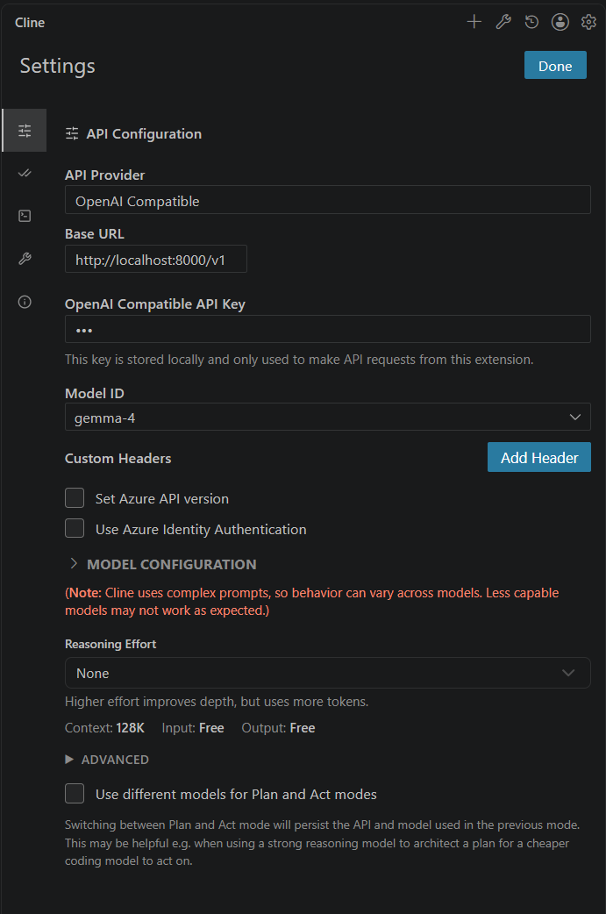

# Gemma-4 Bridge API

Этот проект представляет собой API-мост (bridge), который позволяет взаимодействовать с веб-интерфейсом Gemma-4 через OpenAI-совместимый API, используя Playwright и Chrome в режиме удаленной отладки (CDP).

## 🚀 Быстрый старт

### 1. Подготовка браузера

Для работы сервера Chrome должен быть запущен с открытым портом для удаленной отладки. 

**Запустите Chrome с помощью следующей команды (в терминале или через ярлык):**

```cmd
"C:\Program Files\Google\Chrome\Application\chrome.exe" --remote-debugging-port=9333 --user-data-dir="C:\temp\chrome_debug"
```

> **Важно:** Убедитесь, что все обычные окна Chrome закрыты перед запуском этой команды, либо используйте отдельный профиль (`--user-data-dir`).

### 2. Установка и запуск сервера

#### Клонирование и переход в папку проекта:
```bash
cd C:\Projects\gemma4
```

#### Создание и активация виртуального окружения:
```powershell
# Создание виртуальной среды
python -m venv .venv

# Активация (Windows PowerShell)
.\.venv\Scripts\Activate.ps1
```

#### Установка зависимостей:
```bash
pip install -r requirements.txt
playwright install chromium
```

#### Запуск сервера:
```bash
python app/main.py
```

Сервер будет доступен по адресу: `http://127.0.0.1:8000`

## ⚙️ Настройка (.env)

В папке `app/` можно создать или отредактировать файл `.env` для изменения настроек:

- `CHROME_PATH`: Путь к исполняемому файлу Chrome.
- `CDP_URL`: URL удаленной отладки (по умолчанию `http://127.0.0.1:9333`).
- `CHAT_URL`: URL чата Gemma-4.
- `USER_DATA_DIR`: Папка с данными профиля Chrome.

## 🤖 Настройка Cline (VS Code Extension)

Cline — это расширение для VS Code, которое позволяет использовать AI-ассистента прямо в редакторе. Чтобы подключить его к вашему локальному серверу Gemma-4 Bridge:

### Настройка API в Cline

1. Установите расширение **Cline** из VS Code Marketplace.
2. Откройте настройки Cline (иконка шестеренки в панели расширения).
3. Заполните параметры API:

| Параметр | Значение |
|----------|----------|
| **API Provider** | `OpenAI Compatible` |
| **Base URL** | `http://localhost:8000/v1` |
| **API Key** | Любое значение (например, `dummy-key`) |
| **Model ID** | `gemma-4` |

### Пример интерфейса настроек



*Настройка подключения Cline к локальному серверу Gemma-4 Bridge*

### Проверка подключения

После сохранения настроек, откройте чат Cline (Ctrl+Shift+I) и отправьте тестовое сообщение:
Привет! Расскажи, как работает Gemma-4 Bridge API?

## 🛠 Как это работает

1. **Браузер:** Сервер подключается к уже запущенному экземпляру Chrome через протокол CDP.
2. **API:** Предоставляет эндпоинт `/v1/chat/completions`, который принимает запросы в формате OpenAI.
3. **Автоматизация:** Playwright ищет нужные элементы на странице, вводит текст промпта и считывает ответ от модели в режиме реального времени.

## ⚠️ Возможные проблемы

- **Ошибка "Chrome not available":** Проверьте, запущен ли браузер с флагом `--remote-debugging-port=9333`.
- **Селекторы не работают:** Если интерфейс сайта изменился, обновите селекторы в файле `app/web_selectors.py`.